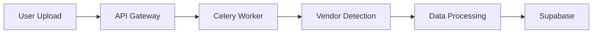

# Contributing to TaskifAI Platform

Thank you for contributing to the TaskifAI Platform! This guide will help you understand our development workflow and contribution standards.

## Table of Contents

- [Git Workflow](#git-workflow)
- [Branch Naming Conventions](#branch-naming-conventions)
- [Commit Message Guidelines](#commit-message-guidelines)
- [Code Standards](#code-standards)
- [Testing Requirements](#testing-requirements)
- [Pull Request Process](#pull-request-process)
- [Documentation](#documentation)

## Git Workflow

We follow a **Git Flow** branching strategy with these main branches:

### Branch Structure

- **`master`** - Production-ready code, stable releases only
- **`develop`** - Integration branch for features, next release preparation
- **`feature/*`** - New features and enhancements
- **`fix/*`** - Bug fixes
- **`hotfix/*`** - Critical production fixes (branch from master)

### Development Workflow

1. **Start New Work**
   ```bash
   # Ensure you're up to date
   git checkout develop
   git pull origin develop

   # Create feature branch
   git checkout -b feature/your-feature-name
   ```

2. **Develop and Commit**
   ```bash
   # Make changes, stage, and commit
   git add .
   git commit -m "feat: add user authentication system"

   # Push to remote
   git push origin feature/your-feature-name
   ```

3. **Create Pull Request**
   - Open PR against `develop` branch (not `master`)
   - Fill out PR template with description and testing notes
   - Request review from team members
   - Address review feedback

4. **Merge Process**
   - Squash commits for clean history (small PRs)
   - Merge commit for complex features (preserves individual commits)
   - Delete feature branch after merge

## Branch Naming Conventions

Follow these naming patterns:

### Feature Branches
```
feature/<short-description>
feature/user-authentication
feature/dashboard-builder
feature/bibbi-multi-reseller-system
```

### Bug Fix Branches
```
fix/<issue-description>
fix/login-redirect-loop
fix/dashboard-widgets-422-error
fix/celery-worker-timeout
```

### Hotfix Branches (Emergency Production Fixes)
```
hotfix/<critical-issue>
hotfix/security-vulnerability-patch
hotfix/payment-processing-failure
```

### Best Practices
- Use lowercase with hyphens (kebab-case)
- Be descriptive but concise (3-5 words max)
- Reference issue numbers when applicable: `fix/issue-123-login-error`

## Commit Message Guidelines

Follow **Conventional Commits** specification for clear commit history:

### Format
```
<type>(<scope>): <subject>

[optional body]

[optional footer]
```

### Types
- **feat**: New feature
- **fix**: Bug fix
- **docs**: Documentation changes
- **style**: Code style changes (formatting, no logic change)
- **refactor**: Code refactoring (no feature change or bug fix)
- **perf**: Performance improvements
- **test**: Adding or updating tests
- **chore**: Build process, tooling, dependencies
- **ci**: CI/CD configuration changes

### Examples
```bash
feat(auth): add JWT refresh token support

fix(uploads): correct Liberty processor EAN padding logic

docs(api): update authentication endpoint documentation

refactor(workers): consolidate upload processing pipeline

test(bibbi): add Liberty processor transformation tests

chore(deps): upgrade FastAPI to v0.110.0
```

### Guidelines
- Use imperative mood: "add" not "added", "fix" not "fixed"
- Keep subject line under 72 characters
- Capitalize subject line
- No period at end of subject
- Separate subject from body with blank line
- Use body to explain what and why, not how

## Code Standards

### Python (Backend)

**Style Guide**: PEP 8 with Black formatter

```bash
# Format code
ruff format .

# Lint
ruff check .

# Type check
mypy .
```

**Standards**:
- Use type hints for function signatures
- Document classes and functions with docstrings
- Maximum line length: 100 characters
- Use f-strings for string formatting
- Async functions for I/O operations

**Example**:
```python
from typing import List, Dict, Optional

async def process_upload(
    file_path: str,
    user_id: str,
    batch_id: str
) -> Dict[str, Any]:
    """
    Process uploaded file and extract data.

    Args:
        file_path: Absolute path to uploaded file
        user_id: UUID of user who uploaded file
        batch_id: Unique batch identifier

    Returns:
        Dictionary with processing results and statistics

    Raises:
        ValueError: If file format is invalid
    """
    # Implementation
    pass
```

### TypeScript (Frontend)

**Style Guide**: Airbnb + TypeScript ESLint

```bash
# Lint
npm run lint

# Format
npm run format
```

**Standards**:
- Use TypeScript strict mode
- Explicit return types for functions
- Interface over type for object shapes
- Functional components with hooks
- Avoid `any` type (use `unknown` if truly dynamic)

**Example**:
```typescript
interface UploadResponse {
  batchId: string;
  status: 'processing' | 'completed' | 'failed';
  recordsProcessed: number;
}

async function uploadFile(
  file: File,
  userId: string
): Promise<UploadResponse> {
  // Implementation
}
```

## Testing Requirements

### Backend Tests

**Minimum Coverage**: 80% for new features

```bash
# Run all tests
pytest

# With coverage report
pytest --cov=app tests/

# Run specific test file
pytest tests/test_liberty_processor.py
```

**Test Structure**:
```python
# tests/test_feature.py
import pytest
from app.services.feature import FeatureService

@pytest.fixture
def feature_service():
    return FeatureService()

def test_feature_basic_functionality(feature_service):
    """Test basic feature operation"""
    result = feature_service.process("input")
    assert result == "expected_output"

def test_feature_error_handling(feature_service):
    """Test feature handles errors gracefully"""
    with pytest.raises(ValueError):
        feature_service.process(None)
```

### Frontend Tests

```bash
# Run tests
npm test

# Watch mode
npm test -- --watch
```

**Test Structure**:
```typescript
// __tests__/Component.test.tsx
import { render, screen } from '@testing-library/react';
import { Component } from './Component';

describe('Component', () => {
  it('renders correctly', () => {
    render(<Component />);
    expect(screen.getByText('Hello')).toBeInTheDocument();
  });

  it('handles user interaction', () => {
    const onSubmit = jest.fn();
    render(<Component onSubmit={onSubmit} />);
    // Test interactions
  });
});
```

## Pull Request Process

### 1. Pre-PR Checklist

Before creating a PR, ensure:

- [ ] Code follows style guidelines
- [ ] All tests pass locally
- [ ] New tests added for new features
- [ ] Documentation updated
- [ ] No merge conflicts with target branch
- [ ] Commits are clean and well-described

### 2. PR Template

```markdown
## Description
Brief description of changes and motivation.

## Type of Change
- [ ] Bug fix
- [ ] New feature
- [ ] Breaking change
- [ ] Documentation update

## Testing
- [ ] Unit tests added/updated
- [ ] Integration tests added/updated
- [ ] Manual testing performed

## Screenshots (if applicable)
[Add screenshots for UI changes]

## Checklist
- [ ] Code follows style guidelines
- [ ] Self-review completed
- [ ] Documentation updated
- [ ] No new warnings generated
```

### 3. Review Process

**Reviewers Will Check**:
- Code quality and readability
- Test coverage and quality
- Security implications
- Performance considerations
- Documentation completeness

**Response Time**:
- Initial review within 24-48 hours
- Follow-up reviews within 24 hours

### 4. Merge Requirements

- ✅ At least 1 approving review
- ✅ All CI/CD checks passing
- ✅ No merge conflicts
- ✅ Up to date with target branch

## Documentation

### When to Update Documentation

Update documentation when you:

- Add new API endpoints → Update `docs/api/`
- Change architecture → Update `docs/architecture/`
- Add deployment steps → Update `docs/deployment/`
- Implement features → Update `docs/development/`

### Documentation Standards

1. **Use Markdown**: All docs in GitHub Flavored Markdown
2. **Code Examples**: Include practical, working examples
3. **Keep Current**: Update docs in same PR as code changes
4. **Link Between Docs**: Use relative links for navigation
5. **Diagrams**: Use Mermaid for architecture diagrams

**Example Mermaid Diagram**:
```markdown

```

## Development Setup

See [README.md](./README.md#development-setup) for local development environment setup.

## Getting Help

- **Questions**: Open a GitHub Discussion
- **Bugs**: Create a GitHub Issue with reproduction steps
- **Features**: Open a GitHub Issue with detailed requirements
- **Security**: Email security@taskifai.com (do not create public issues)

## Code of Conduct

Be respectful, inclusive, and professional. We're all here to build great software together.

## License

By contributing, you agree that your contributions will be licensed under the project's license.

---

Thank you for contributing to TaskifAI! 🚀
